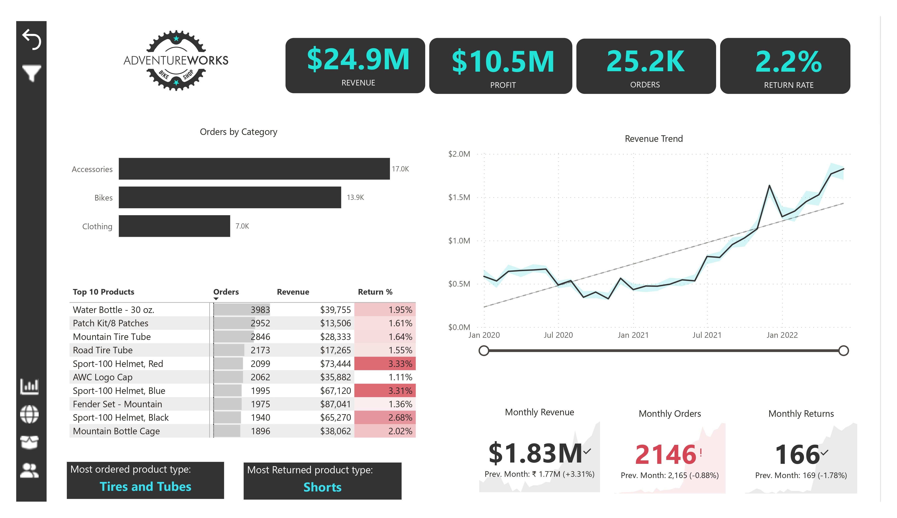
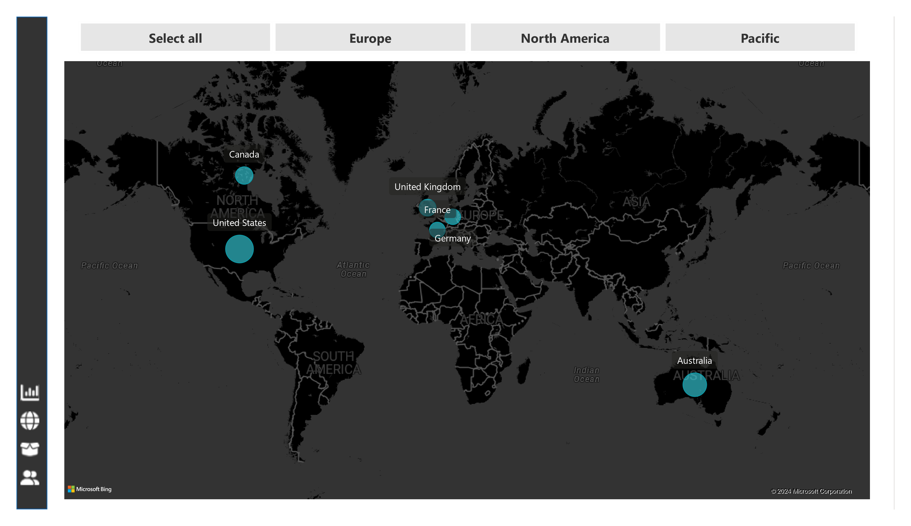
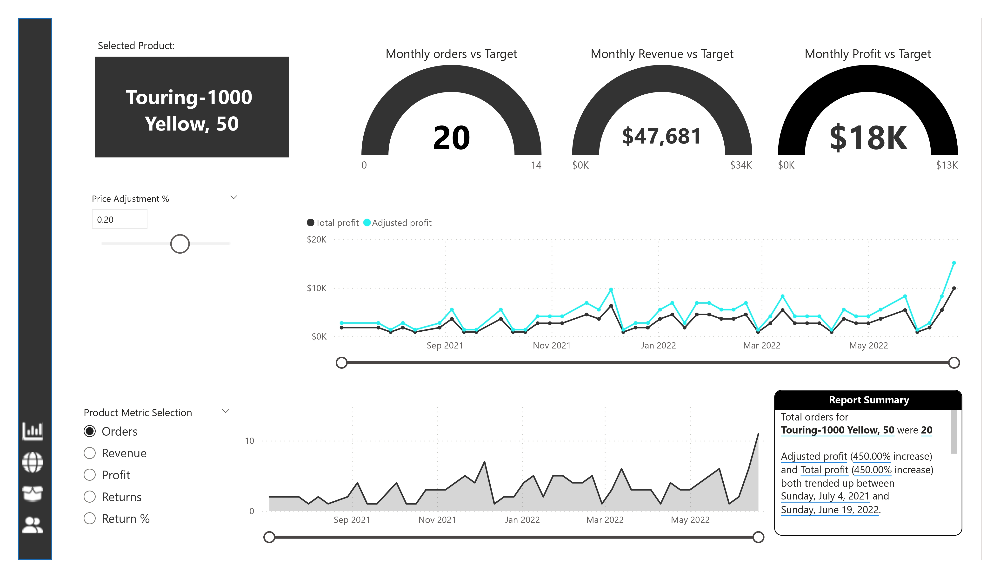
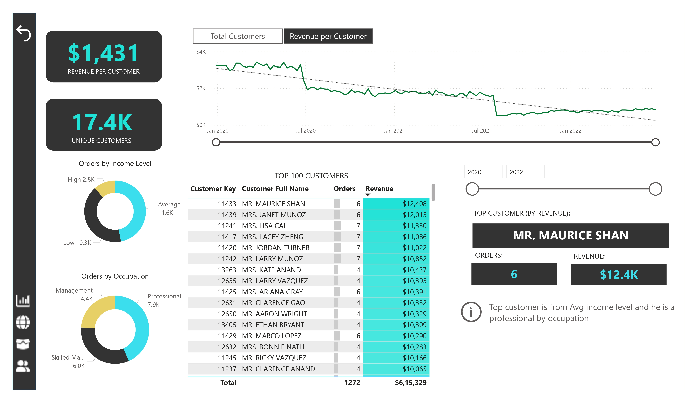

# Adventure Works Project
This project presents an in-depth analysis of Adventure Works, a fictitious company, using Power BI. The analysis covers customer segmentation, geographical analysis, product analysis, and provides an overall summary of the company's performance based on key performance indicators (KPIs) and important metrics.

## Key Features

- Customer Segmentation: Segmented customers based on demographics, buying behavior, and other relevant factors.

- Geographical Analysis: Analyzed sales and customer distribution across different regions using interactive maps and charts.

- Product Analysis: Examined product performance, sales trends, and profitability.

- KPIs and Metrics: Presented essential KPIs such as revenue, profit margins, customer retention rates, etc., to assess company performance.

- Trend Analysis: Identified trends over time to understand growth areas and potential challenges

##Tools used: Power BI, Power Query
