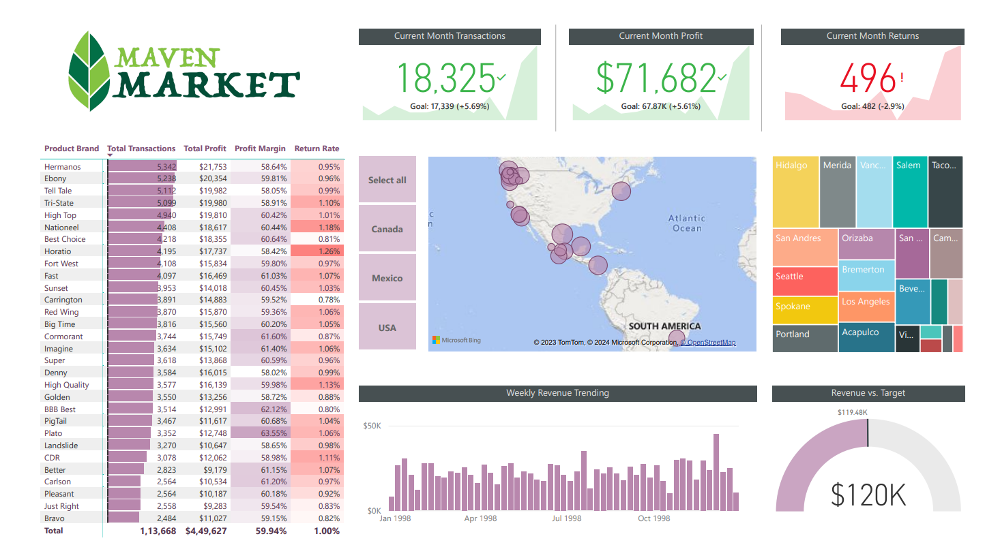
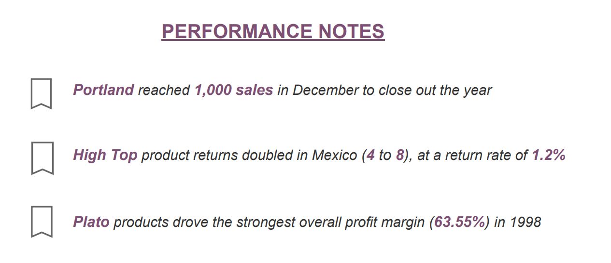

# Maven Market Project(Market Analysis)
 This repository contains the analysis of Maven Market, focusing on market trends, customer segmentation, geographical insights, product analysis, and key performance indicators (KPIs). The analysis aims to provide actionable insights for strategic decision-making.

## Key Features
- Market Trends Analysis: Examined trends in the Maven Market industry, including growth rates, market share, and emerging opportunities.
- Customer Segmentation: Segmented customers based on demographics, purchasing behavior, and preferences.
- Geographical Insights: Analyzed sales and customer distribution across different regions to identify regional performance variations.
- Product Analysis: Evaluated product performance, profitability, and identified top-selling products.
- KPIs and Metrics: Presented essential KPIs such as revenue, profit margins, customer retention rates, etc., to assess company performance.

## Tools Used:
Power Bi, Power Query